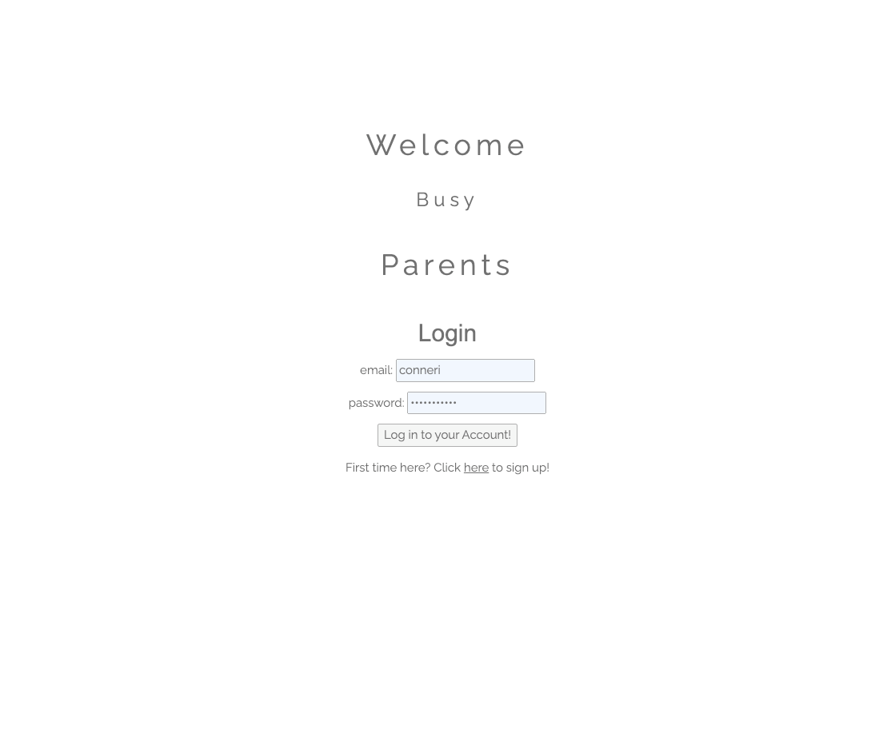

#  PROJECT-2: BUSY PARENTS


[](https://github.com/crumwj22/busy-parents.git)


     


## TABLE OF CONTENTS
- [Project-2: Busy Parents Home](#project-2-busy-parents)
- [Project Description](#project-description)
- [User Story](#user-story)
- [Project Requirements](#project-requirements)
- [Deployed Links](#deployed-liks)
- [New Tech](#new-tech)
- [Screenshots](#screenshots)
- [Contributions and Roles](#contributions-and-roles)


## PROJECT DESCRIPTION
This web application allows parents to create an account, and use that account to search rideshare information as a rider or driver in their local city. Parents are able to comment on the provided locations to sign their child up for the carpool. Drivers will have the option to provide locations where they will pick up and drop off children. As a driver, you will also be able to view all of the rides you have made yourself availble too throughout the week.


## USER STORY: 
```md
As a Parent planning my kid’s day,
I want to see carpool information in my city for the week,
So that I can arrange our schedule ahead of time.
```


## PROJECT REQUIREMENTS

You and your group will use everything you’ve learned over the past six units to create a real-world full-stack application that you’ll be able to showcase to potential employers. The user story and acceptance criteria will depend on the project that you create, but your project must fulfil the following requirements:

* Use Node.js and Express.js to create a RESTful API.

* Use Handlebars.js as the template engine.

* Use MySQL and the Sequelize ORM for the database.

* Have both GET and POST routes for retrieving and adding new data.

* Use at least one new library, package, or technology that we haven’t discussed.

* Have a folder structure that meets the MVC paradigm.

* Include authentication (express-session and cookies).

* Protect API keys and sensitive information with environment variables.

* Be deployed using Heroku (with data).

* Have a polished UI.

* Be responsive.

* Be interactive (i.e., accept and respond to user input).

* Meet good-quality coding standards (file structure, naming conventions, follows best practices for class/id naming conventions, indentation, quality comments, etc.).

* Have a professional README (with unique name, description, technologies used, screenshot, and link to deployed application).


## DEPLOYED LINKS

- [VIEW LIVE APP](https://busy-parents-jesse.herokuapp.com/)
- [GITHUB](https://github.com/crumwj22/busy-parents)


## NEW TECH

- Animate: https://animate.style/
- W3Schools css framework: https://www.w3schools.com/w3css/default.asp


## SCREENSHOT
* 


## CONTRIBUTIONS AND ROLES
- Avi Rana: Back End and Front End [Github](https://github.com/AR31313)
- Jesse Crumley: Back End and Support [Github](https://github.com/crumwj22)
- Nikolas Mazur: Back End and Support [Github](https://github.com/NikolasMazur)
- Conner Iraola: back End and Spport [Github](https://github.com/conneriraola)